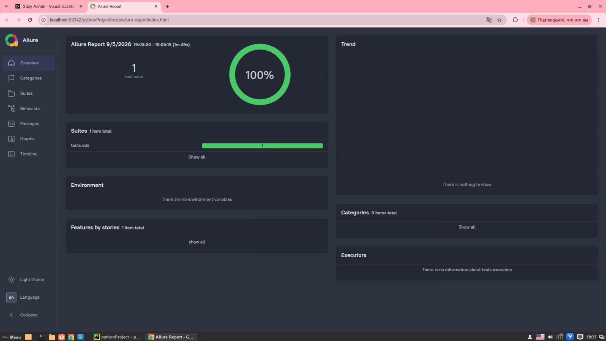
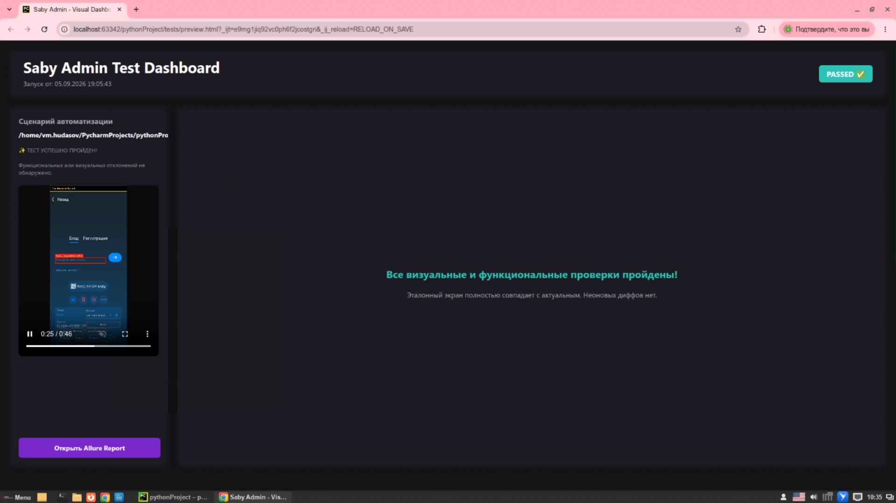

# E2E Automation: Saby Admin Android & Linux CLI

[](https://www.python.org/)
[](https://appium.io/)
[](https://pytest.org/)
[](https://www.redhat.com/)
[](https://qameta.io/)

Фреймворк для сквозного E2E-тестирования распределённого протокола удалённого управления между мобильным приложением **Saby Admin (Android)** и CLI-утилитой **SabyAdminConsoleOperator (Linux x86_64)**.

Реализует синхронизацию через псевдотерминалы (PTY), обработку двустороннего JSON-RPC протокола и валидацию системных механизмов Android (шторка «Поделиться», стеки Push-уведомлений) с непрерывной записью видеопотока и наложением HUD-метрик.

---

## 📺 Демонстрация прогонов и отчетность (Visual Showcase)

### 1. Видеозаписи сквозных прогонов в обеих ролях

<table>
  <tr>
    <th width="50%" align="center">Роль 1: Android = Клиент (<code>test_client_connection.py</code>)</th>
    <th width="50%" align="center">Роль 2: Android = Оператор (<code>test_operator_connection.py</code>)</th>
  </tr>
  <tr>
    <td>
      <video src="https://github.com/user-attachments/assets/5e39e0ac-6317-4e36-8899-0d8f0f6fe9db" controls="controls" width="100%">
        Ваш браузер не поддерживает встроенное видео. Скачайте файл: <a href="docs/media/converted_mp4/video_client_role.mp4">video_client_role.mp4</a>
      </video>
      <p align="center"><i>Клиент генерирует код, принимает подключение Linux-оператора, отдаёт файл через Sharesheet и валидирует пуш.</i></p>
    </td>
    <td>
      <video src="https://github.com/user-attachments/assets/476b4ded-674b-4ff8-bd7e-e889574e2efd" controls="controls" width="100%">
        Ваш браузер не поддерживает встроенное видео. Скачайте файл: <a href="docs/media/converted_mp4/video_operator_role.mp4">video_operator_role.mp4</a>
      </video>
      <p align="center"><i>Мобильный оператор подключается к удалённому хосту по коду, разворачивает сессию управления и передаёт команды.</i></p>
    </td>
  </tr>
</table>

> *Примечание: Записи сформированы встроенным модулем `VideoRecorder` на OpenCV с динамическим наложением HUD-баннеров статусов шагов.*

---

### 2. Артефакты тестового запуска

| Интерактивный Allure Report | Кастомный Dashboard (`preview.html`) |
| :---: | :---: |
|  |  |
| *Иерархия шагов, тайминги, параметры окружения и прикреплённые артефакты.* | *Автономный HTML-дашборд с интегрированным видеоплеером прогона и хронометражем шагов.* |

---

## 🔄 Dual-Role Архитектура сценариев

Фреймворк валидирует обе стороны распределенной системы:

```text
       СЦЕНАРИЙ А: Android в роли КЛИЕНТА                СЦЕНАРИЙ Б: Android в роли ОПЕРАТОРА
       
   ┌────────────────┐        ┌──────────────────┐       ┌────────────────┐        ┌──────────────────┐
   │ Android Device │        │    Linux CLI     │       │ Android Device │        │    Linux CLI     │
   │  (Saby Admin)  │        │(SabyAdminConsole)│       │  (Saby Admin)  │        │(SabyAdminConsole)│
   └───────┬────────┘        └───────┬──────────┘       └─────┬──────────┘        └───────┬──────────┘
           │ 1. Вывод кода           │                        │ 1. Авторизация и ввод кода│
           │────────────────────────>│                        │<──────────────────────────│
           │                         │                        │                           │
           │ 2. Запрос на подключение│                        │ 2. Запрос на подключение  │
           │<────────────────────────│                        │──────────────────────────>│
           │                         │                        │                           │
           │ 3. Сессия управления    │                        │ 3. Сессия управления      │  
           │<═══════════════════════>│                        │<═════════════════════════>│           
           │                         │                        │                           │  
           │ 4. Sharesheet -> Файл   │                        │ 4. Переключение экрана    │
           │────────────────────────>│                        │──────────────────────────>│
           │                         │                        │                           │
           │ 5. Push-уведомление     │                        │ 5. Смена ориентации       │
           │ передачи файлов         │                        │<───┐                      │
           │<───┐                    │                        │────┘                      │
           │────┘                    │                        │                           │  
           │                         │                        │ 6. Завершение сессии      │
           │ 6. Disconnect           │                        │<──────────────────────────│      
           │<────────────────────────│                        └───────────────────────────┘
           └─────────────────────────┘
```
## 🛠 Инженерные решения и преодоление ограничений

### 1. Неблокирующий PTY-контроллер нативного бинарника
* **Проблема:** Запуск нативного C/C++ бинарника через стандартный `subprocess.Popen(stdout=subprocess.PIPE)` приводил к дедлоку из-за системной буферизации ввода-вывода в Linux.
* **Решение:** В классе `SabyAdminConsole` реализован запуск через псевдотерминал `pty.openpty()`. Демон-поток считывает сырые байты в неблокирующем режиме, парсит JSON-сообщения (`type_id`: 47, 2, 7, 21, 13, 19, 20, 5) и наполняет потокобезопасную очередь событий для тестового раннера.

### 2. Автоматизация Android Sharesheet и вложенных Push-групп
* **Проблема:** В системной шторке передачи (`ChooserActivity`) клик по дочернему `TextView` игнорируется системой, если слушатель привязан к родительскому контейнеру. Кроме того, уведомление о передаче файла часто схлопывается внутрь системной группы Saby Admin.
* **Решение:**
  * Реализованы отказоустойчивые составные локаторы с динамическим подъемом к кликабельному контейнеру:  
    `//*[contains(@text, 'Saby Admin')]/ancestor-or-self::*[@clickable='true']`.
  * Разработана безопасная двухфазная верификация уведомлений: системное раскрытие шторки (`driver.open_notifications()`), мягкий поиск кнопки аккордеона группы без падения по таймауту и верификация текста целевого push-сообщения.

### 3. Real-Time HUD Видеорекордер на OpenCV
* **Проблема:** Стандартные инструменты записи видео в Appium не дают контекста при анализе причин падений на длинных распределённых E2E-сценариях.
* **Решение:** Модуль `VideoRecorder` считывает графический буфер драйвера в отдельном потоке и динамически впечатывает HUD-плашки (название текущего шага, статус выполнения, цветовая маркировка) непосредственно в видеокадры перед их записью в медиаконтейнер.

### 4. Сохранение работы системной службы спецвозможностей (Accessibility Service)
* **Проблема:** При инициализации тестовой сессии сервер `UiAutomator2` по умолчанию принудительно подавляет и замораживает все сторонние службы доступности (`AccessibilityService`) на уровне ОС Android, предотвращая коллизии диспетчеризации жестов. Так как **Saby Admin** использует собственный сервис специальных возможностей для удалённого ассистирования и трансляции событий ввода, приложение теряло системные права сразу после старта драйвера.
* **Решение:** В конфигурацию сессии Appium был внедрён низкоуровневый хук драйвера, блокирующий подавление служб доступности ядром UiAutomator2:
  ```python
  # Защита от глушения Accessibility Service приложения Saby Admin
  options.set_capability("disableSuppressAccessibilityService", True)
  options.set_capability("skipServerInstallation", False)
---

## 📂 Структура проекта

```text
.
├── src/
│   ├── locators/android/          # Типизированные селекторы (Main, Notification, System, Settings, Auth, Onboarding)
│   └── pages/android/             # Page Objects с умными ожиданиями и индикаторами
├── tests/
│   └── e2e/
│       ├── conftest.py                  # Инициализация сессий, хуки драйвера, видео и Allure отчёта
│       ├── test_client_connection.py    # Сценарий: Android в роли Клиента
│       └── test_operator_connection.py  # Сценарий: Android в роли Оператора
├── utils/
│       ├── saby_admin_console.py  # PTY-контроллер управления CLI-утилитой Linux
│       └── video_recorder.py      # OpenCV-рекордер с наложением HUD
├── docs/media/                    # Видео прогонов и скриншоты отчетов
└── pytest.ini                     # Настройки таймаутов и маркеров
```
## 🚀 Быстрый запуск

### Системные требования
* Linux x86_64
* Python 3.11+
* Android SDK (Эмулятор с API 24+)
* Appium 2.x (`uiautomator2` driver)
* Скомпилированный бинарный файл `SabyAdminConsoleOperator`

### Установка и настройка

```bash
# 1. Клонирование репозитория
git clone [https://github.com/UniverseQA/Demo.git](https://github.com/UniverseQA/Demo.git)
cd Demo

# 2. Создание виртуального окружения
python3 -m venv venv
source venv/bin/activate

# 3. Запуск Appium сервера
appium --address 127.0.0.1 --port 4723
```

## Запуск сценариев
```bash
# Запуск сценария "Android = Клиент" с формированием Allure-отчёта
pytest -s -v tests/e2e/test_client_connection.py --alluredir=tests/allure-results

# Запуск сценария "Android = Оператор"
pytest -s -v tests/e2e/test_operator_connection.py --alluredir=tests/allure-results

# Генерация и открытие отчёта
allure serve tests/allure-results
```
